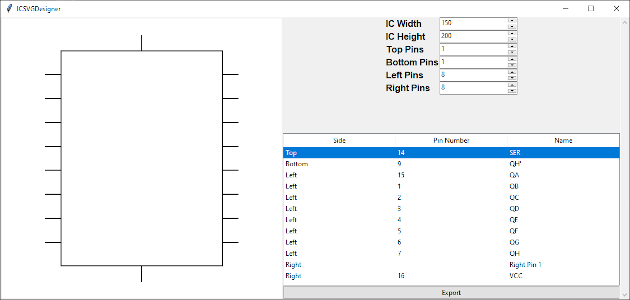
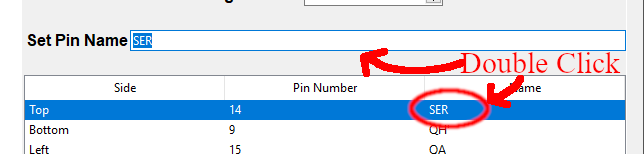

# IC SVG Designer
A small utility to design SVG Schematic Symbols for ICs.



[Youtube Overview](https://www.youtube.com/watch?v=DHbs9OUd5ew&pp=ygUPaWMgc3ZnIGRlc2lnbmVy)

### Running
Either clone the Repo from [Github](https://github.com/AdamantLife/ICSVGDesigner) or download the Windows Executable from the [Releases Page](https://github.com/AdamantLife/ICSVGDesigner/releases).

If you cloned the Repo you can install the ICSVGDesign using the setup file in the toplevel directory, for example `pip install .` (from within the toplevel). The GUI can be initialized with any of the following commands:
```
# Added via pip install, available anywhere
icsvgdesigner
python -m ICSVGDesigner

# From within the ICSVGDesigner source folder (no install required)
python __init__.py
python __main__.py
```

### Usage
* Width and Height of the body and number of Pins each side are set numerically
* Left-click on a pin in the Preview Window to disable it- it will not be exported
* Left-clicking a Pin (row) in the output table will highlight it in Blue in the Preview Window

* Each Pin can have a name assigned to it by double clicking the **Name** column of that Pin and supplying a name in the displayed entry
* Each Pin can have a *unique* pin number assigned to it by double clicking the **Pin Number** of that Pin and supplying a number in the displayed entry
* To output the SVG, click the **Export** button
  * This will bring up a **File Save As** system dialog which you can use to give it a file name
* This will also output a Text file which contains two sets of Coordinates
  * Coordinates for each Pin based on a Top-Left (standard) origin
  * Coordinates for each Pin based on a Center-based origin

### Problems and Feature Requests
If you run into problems be sure to document them on the [Issues](https://github.com/AdamantLife/ICSVGDesigner/issues) page. If there's a feature you would like to see added, feel free to suggest it there as well.
